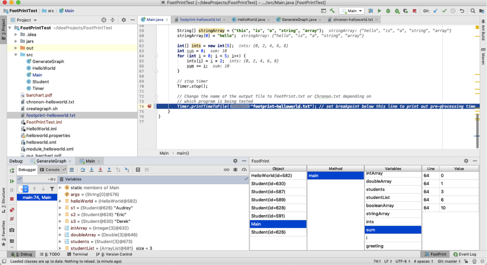
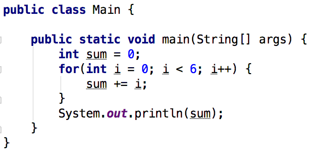
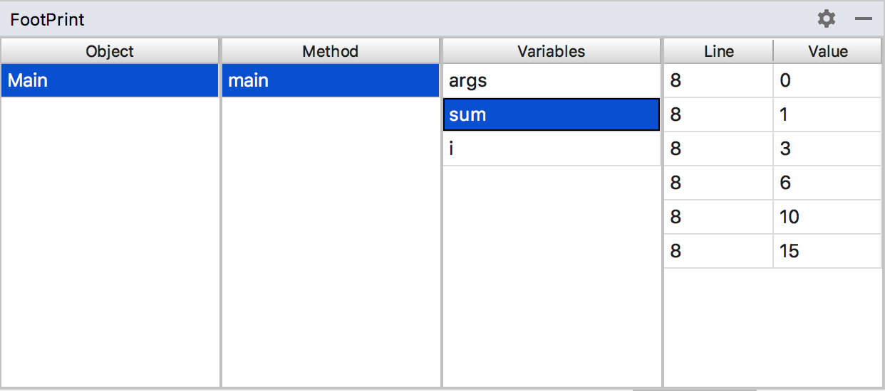
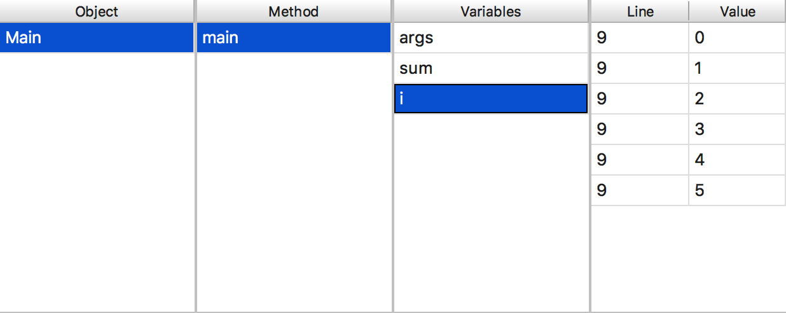

# FootPrint: A Variable History Viewer

### Current Status:

Version 1.0 has been published to the JetBrains repository and is now publicly available.

FootPrint tracks the histories of all local variables and fields of classes that are stepped into automatically. This works for both primitives and objects. Objects are displayed via their toString(). Via breakpoints under the hood, FootPrint collects the full history of variables up until where the debugger is suspended. FootPrint's UI separates variables and fields based on class/object and method.

# User Manual

## About:

FootPrint is a user-friendly, lightweight, and simple plugin for IntelliJ that allows Java developers to view the history of their variables. FootPrint is great for developers who often find themselves overstepping in the regular IntelliJ debugger. Instead of having to restart the debugging process, users can use FootPrint to view their variables’ histories and the line numbers at which values were changed. FootPrint will automatically track all local variables as well as fields of objects the user steps into. At any point in the debugging process, they can click to expand on a variable to view the previous values that it was assigned to, as well as which line these values were updated. Furthermore, by studying their variable’s history, a developer can better understand what is going on in a program. For example, if a method has unexpected side effects on other variables of interest, FootPrint would allow a user to easily see that.

## Example: 
 
Consider this scenario:

 
The user wants to track how the variables `sum` and `i` change throughout the for loop. The user first sets debugging breakpoints as normal and starts a debugging session by clicking on the FootPrint icon. The user can debug as usual while FootPrint records the different values that `sum` and `i` were previously assigned (along with line numbers where the change occurred). The histories can be accessed anytime throughout the debugging process. FootPrint will create the following output for their histories:

Selecting sum:

 
Selecting i:

		 
## Installation:

1) In Intellij, navigate to `Settings` and select `Preferences.` 
2) Select the `Plugins` option
3) Select `Browse Repositories` and search for FootPrint
4) Select `Install` and confirm. After restarting Intellij, you should now see the FootPrint icon in the upper right hand toolbar next to the Debug button.

You can view FootPrint on JetBrains [here](https://plugins.jetbrains.com/plugin/12051-footprint)
 
## Instructions:

1) Set breakpoints and click the FootPrint icon , found in the upper right next to the regular IntelliJ Debugger icon. This should start a debugging session for most recently executed program
2) Step through your program as normal; all local variables and fields of the classes you step in will be automatically tracked.
3) Click on the 'FootPrint' button on the bottom right. 
4) This opens a separate pane alongside the debugger window, where you should see a list of your classes, methods of the selected class, and variables in the selected method. Clicking on a the name of one of these variables at any point in the debugging process will display their value history along with which line the value was updated from the start of the program up to whichever line you are currently at in the debugger.
5) When you are finished, you can simply exit FootPrint by stopping the debugging session as usual. Clicking again on the FootPrint button will also collapse the FootPrint pane.

Congrats! You have successfully used FootPrint.

# Developer Manual

## Dependencies:

* [Java 8](http://www.oracle.com/technetwork/java/javase/downloads/jdk8-downloads-2133151.html)
* IntelliJ version 2018.1+

## Cloning The Repository:

1) On the repository page, select `Clone or download` and copy the link provided
2) `cd` into the directory in which you want to store the project
3) run the command `git clone <url>` where the url is the link from step 1

Congrats! You have cloned the repository.

## Importing to IntelliJ

Once you have cloned the repo, you can follow these instructions to import the project to IntelliJ:

1) On the Intellij start page, select Import and then select the FootPrint folder and follow the prompts
2) Once FootPrint is imported, you will see a pop-up that says `Unlinked Gradle Project`; select the option to link it
3) Select `use gradle 'wrapper' task configuration` and continue (the other default settings can be kept if desired)

Congrats! You have imported the project to IntelliJ.

## Build and Test:

FootPrint uses Gradle as its build system. You can trigger a build by running `./gradlew build` from the root directory.

This command will build the project and run any tests in the `/src/test/` folder.

If you wish to test FootPrint in the IDE, you can use the `Gradle` Tool Window in IntelliJ. Then double click `footprint-plugin/Tasks/intellij/runIde`. This will launch a separate IntelliJ window where you will see the FootPrint icon in the upper right hand corner. Here, you may test the functionality of FootPrint.

## Experiment Results:

If you would like to view/reproduce our experimental data on FootPrint, the repo can be found [here](https://github.com/hangbuiii/FootPrintTest)